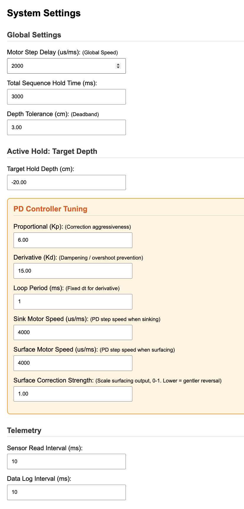

# ROV Float Controller

MATE ROV Competition — **FLOAT** task, **RANGER** class. Active buoyancy control using a syringe piston driven by a stepper motor, with depth feedback from an MS5837 pressure sensor.

## Hardware

| Component | Detail |
|-----------|--------|
| MCU | ESP32 (dual-core FreeRTOS) |
| Pressure Sensor | MS5837-30BA (I2C `0x76`) |
| Stepper | 17NEMA3401 42-step, driving syringe piston |
| Power | USB or external 5V |

### Pinout

| Pin | Function |
|-----|----------|
| 4 | Stepper direction (`dirPin`) |
| 16 | Stepper step (`stepPin`) |
| 18 | Upper limit switch (INPUT_PULLUP, LOW = triggered) |
| 19 | Lower limit switch (INPUT_PULLUP, LOW = triggered) |
| 21 | I2C SDA |
| 22 | I2C SCL |

## Build & Upload

**Target:** ESP32 (Arduino framework).

1. Open `ROVfloat/ROVfloat.ino` in Arduino IDE (or PlatformIO)
2. Install the vendored libraries from `libraries/`:
   - `BlueRobotics_MS5837_Library`
   - `Arduino_ESP32_OTA`
3. Select board **ESP32 Dev Module**
4. Compile & upload

## WiFi

| Setting | Value |
|---------|-------|
| Mode | Access Point |
| SSID | `SSCFLOAT-RN` |
| Password | `12345678` |
| mDNS | `http://sscfloat.local` |

Connect to the WiFi network, then open `http://sscfloat.local` (or the AP IP) in a browser.

## Web Interface

| Endpoint | Description |
|----------|-------------|
| `/` or `/control` | Main dashboard — mode dispatch (stop, home, manual, sequences) |
| `/data` | Raw telemetry (depth, pressure, position) |
| `/config` | Tune all settings (PD gains, motor speed, tolerances) |
| `/live` | Wireless serial terminal mirror (auto-refreshing) |
| `/livedata` | Raw log buffer (used by `/live` AJAX) |

OTA firmware updates supported via ArduinoOTA.

## Architecture

Single-file, multi-core FreeRTOS (`ROVfloat.ino`, ~780 lines).

| Core | Tasks |
|------|-------|
| Core 0 | `sensorTask` — MS5837 depth readings at 50ms fixed-rate, median-of-3 filter. `webTask` — HTTP server. `otaTask` — ArduinoOTA |
| Core 1 | `motorTask` — state machine dispatcher + all sequences |

**Thread safety:** 4 mutexes — `dataLock`, `modeLock`, `configLock`, `logLock`.

## Depth Convention

Deeper = more negative (relative to surface offset). The PD error `currentDepth - targetDepth` is **positive when too shallow**, triggering sink correction.

## Control Modes

| Mode | Description |
|------|-------------|
| `IDLE` | Default, motor stopped |
| `HOMING` | Drives piston up to top limit switch, zeros position counter |
| `MANUAL_PULSE` | Timed manual jog (direction + duration) |
| `TARGET_STEP` | Absolute position move to target step count |
| `FULL_BUMP` | Sinks to bottom limit, holds, surfaces |
| `ACTIVE_DEPTH` | PD depth hold — maintains target depth indefinitely |

All sequences except `ACTIVE_DEPTH` end by surfacing and returning to `IDLE`. `ACTIVE_DEPTH` runs until E‑STOP or bottom‑limit emergency.

## PD Depth Controller

Pure PD (no integral), operating on raw depth with median-of-3 outlier rejection.

### Tunable Parameters

| Parameter | Default | Description |
|-----------|---------|-------------|
| `Kp` | 2500 | Proportional gain (steps per meter of error) |
| `Kd` | 800 | Derivative gain (damping) |
| `pdLoopDelayMs` | 100 | Fixed-dt loop period (ms) |
| `sinkHoldSpeed` | 6000 | Motor speed when sinking (µs/ms) |
| `surfaceHoldSpeed` | 6000 | Motor speed when surfacing (µs/ms) |
| `surfaceOutputScale` | 0.5 | Surfacing correction scale (0–1), prevents overshoot |
| `depthToleranceCm` | 3.0 | Deadband (cm) — engage above, disengage at 0.7× |
| `targetHoldDepthCm` | -40.0 | Target relative depth (cm, negative = deeper) |

### Key Features

- **True fixed-dt** enforcement — motor time subtracted from loop delay
- **Actual-dt derivative** — uses measured elapsed time between iterations (not configured dt), so damping stays accurate even when motor step bursts exceed the loop period
- **Median-of-3 depth filter** — ~50ms group delay, rejects single-sample spikes
- **Deadband hysteresis** — engages at tolerance, disengages at 0.7× tolerance to prevent chattering
- **Step cap** — 500 steps/iteration max, prevents violent single-burst corrections
- **Bottom-limit safety** — emergency surfaces if lower limit switch triggers during PD hold

### Derivative Timing Fix

The derivative term uses **actual measured elapsed time** from `millis()` rather than the configured `pdLoopDelayMs`. When a large correction issues up to 500 motor steps (~3 seconds), the derivative correctly divides by the real time interval, maintaining accurate damping. Without this fix, the derivative would be severely underestimated during large corrections (18× smaller when motor time is 1.8s vs configured 0.1s).

## Global Settings

| Parameter | Default | Description |
|-----------|---------|-------------|
| `motorSpeed` | 2000 | Global step delay (µs/ms) for non-PD modes |
| `floatWaitTimeMs` | 30000 | Hold time in sequences (ms) |
| `sensorReadIntervalMs` | 50 | Sensor loop period (ms) |
| `sensorLogIntervalMs` | 100 | Telemetry log interval (ms) |

## Current System Settings

*Default PD controller and telemetry configuration on the `/config` page.*

## Sensor Details

- MS5837-30BA at OSR 8192 (highest resolution)
- Each `read()` takes ~40ms (2× ADC conversions at 20ms each)
- Pressure anomaly filter: rejects readings outside 500–3000 hPa
- Median-of-3 filter on depth with fixed-rate `vTaskDelayUntil` scheduling
- Surface offset captured at boot

## Safety

- Dual limit switches (top/bottom) prevent piston overrun
- Emergency stop via web button immediately halts motor
- Bottom limit hit during PD triggers automatic emergency surface
- Outlier rejection on sensor pressure values
- Step cap prevents violent position changes

## License

MIT
